# Iron Man Helmet

A functional 3D-printed Iron Man helmet combining **mechanical design, embedded programming, electronics and surface finishing** in one compact mechatronics project.

The helmet uses an **ESP32** to control two servos for the moving faceplate and a PWM-controlled lighting output for the eyes. The firmware is developed with **PlatformIO**, the **Arduino framework** and **C++**.

<p align="center">
  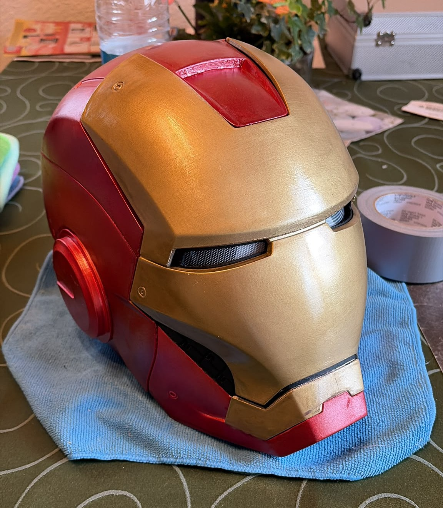
</p>

## Project Overview

The goal was not only to build a visually convincing helmet, but to integrate the mechanics and electronics into a functional wearable system.

Starting from a printable helmet model, I adapted and extended the design for the actual hardware. This included custom mechanical parts for the faceplate mechanism, a compact servo mounting solution and the internal integration of the controller, wiring and lighting electronics.

The project combines four main areas:

- **Mechanical design** – custom servo mounting, axes and connecting parts
- **Electronics** – ESP32, two servos, lighting control and button input
- **Embedded software** – mirrored servo movement, state logic and PWM control
- **Finishing** – preparation, priming and painting of the printed parts

## Mechanical Design

The faceplate mechanism had to fit into the limited space inside the helmet while still moving reliably.

Several parts were adapted or designed in **Fusion 360**, including the servo mounting system and connecting components used to guide the faceplate movement.

<p align="center">
  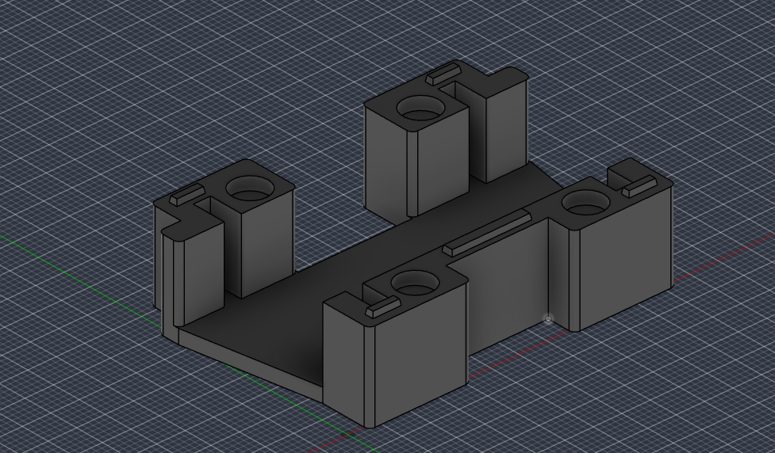
  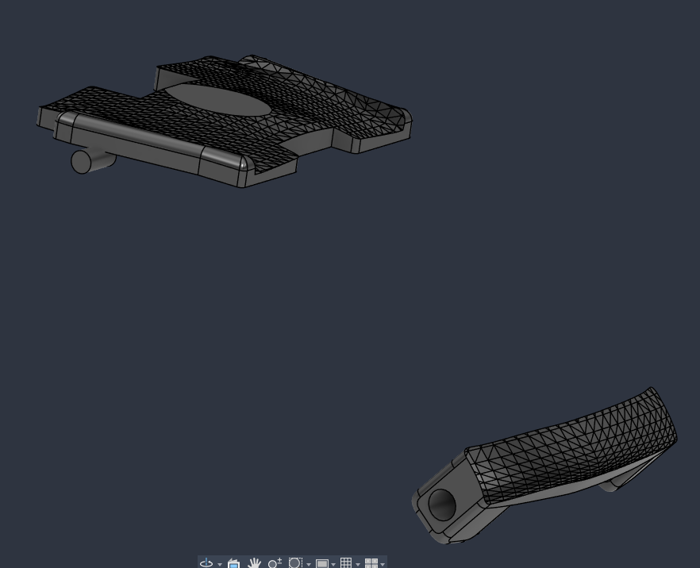
</p>

The mechanical system was then tested in an early assembled version before the final finishing and electronics integration.

<p align="center">
  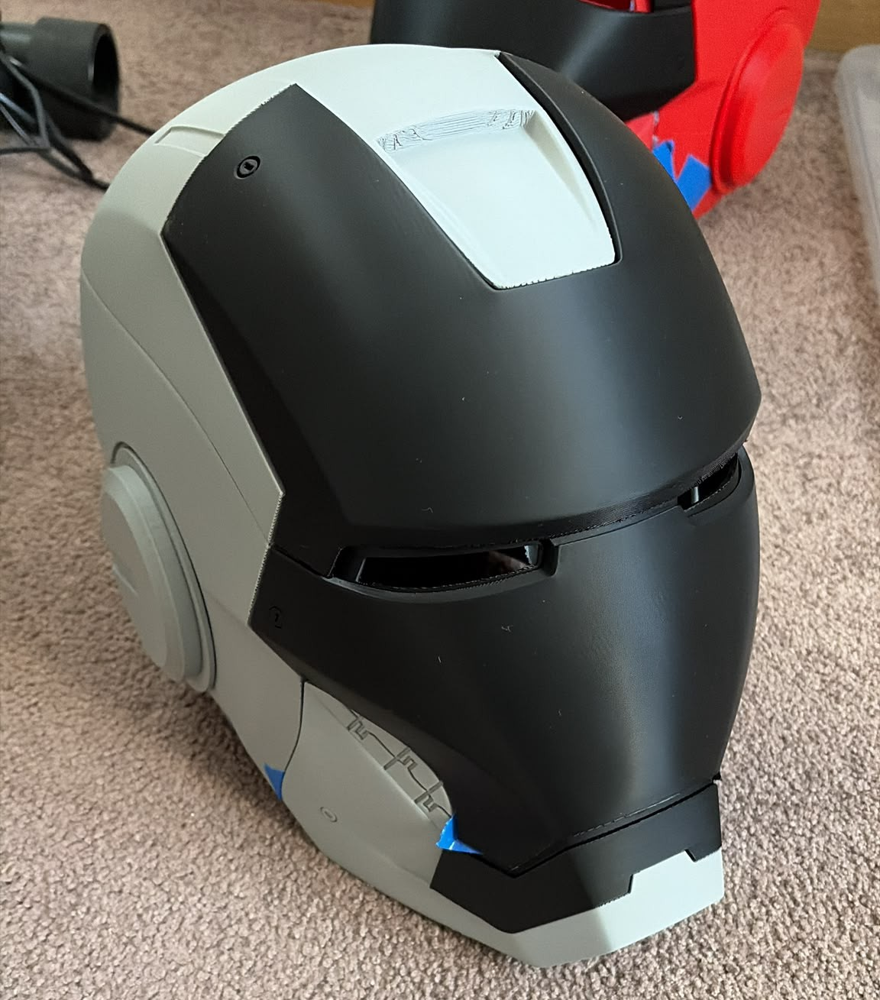
</p>

## Electronics

The control system is built around an **ESP32**.

### Main Components

- ESP32 development board
- 2 × MG90S servos
- MOSFET module for the eye lighting
- push button
- LED eye lighting
- 5 V power supply
- 3D-printed mounting components and internal wiring

The electronics were first tested outside the helmet and then integrated into the available internal space.

<p align="center">
  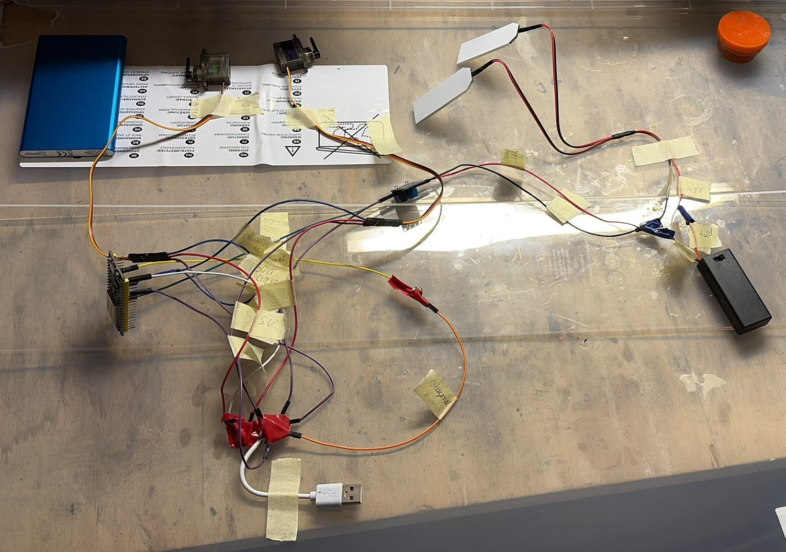
  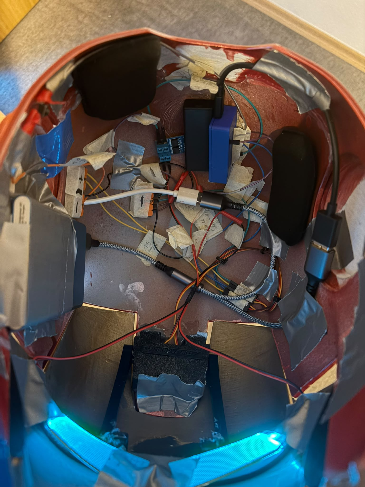
</p>

The internal layout was designed to keep the controller, power distribution and wiring compact while still leaving enough room for the faceplate mechanism.

<p align="center">
  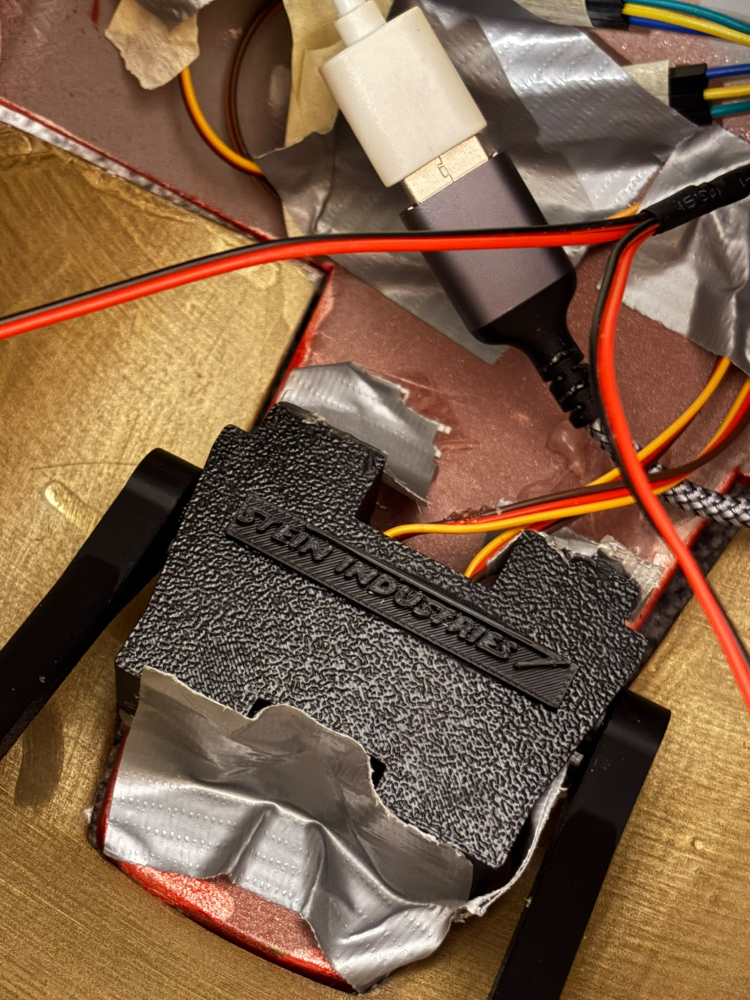
</p>

## Pin Assignment

| Function | ESP32 Pin |
|---|---:|
| Left servo | GPIO 18 |
| Right servo | GPIO 19 |
| Eye lighting / PWM | GPIO 23 |
| Push button | GPIO 4 |

The button uses the ESP32's internal pull-up resistor.

## Embedded Software

The firmware is contained in:

```text
src/main.cpp
```

and is built with PlatformIO using the Arduino framework.

The software implements a simple two-state control system:

```text
Button press
    │
    ▼
Check current helmet state
    │
    ├── CLOSED → run opening sequence → OPEN
    │
    └── OPEN   → run closing sequence → CLOSED
```

During movement, both servos are controlled together but rotate in mirrored directions because of their mechanical orientation.

For the opening sequence:

```text
Left servo:    0°   → 110°
Right servo: 180°   →  70°
```

The eye output is controlled through an ESP32 PWM channel, allowing the lighting intensity to be changed programmatically during the movement sequence.

After each button press, the firmware waits until the button is released before another action can be triggered.

## PlatformIO Configuration

The project uses the following environment:

```ini
[env:esp32dev]
platform = espressif32
board = esp32dev
framework = arduino
lib_deps = madhephaestus/ESP32Servo@^3.1.3
monitor_speed = 115200
```

### Main Dependency

The servos are controlled using:

```text
ESP32Servo
```

## Project Structure

```text
iron-man-helmet/
├── docs/
│   └── images/
├── src/
│   └── main.cpp
├── .gitignore
├── platformio.ini
└── README.md
```

PlatformIO build files such as `.pio/` and local VS Code configuration are intentionally excluded from version control.

## Build & Upload

### Requirements

- Visual Studio Code
- PlatformIO extension
- compatible ESP32 development board

### Build

Open the repository as a PlatformIO project and run:

```text
PlatformIO: Build
```

or from a PlatformIO CLI environment:

```bash
pio run
```

### Upload

Connect the ESP32 and run:

```text
PlatformIO: Upload
```

or:

```bash
pio run --target upload
```

The serial monitor is configured for:

```text
115200 baud
```

## Surface Finishing

The printed parts were prepared and finished after the mechanical fit had been verified.

The process included surface preparation, priming and painting before the final assembly.

<p align="center">
  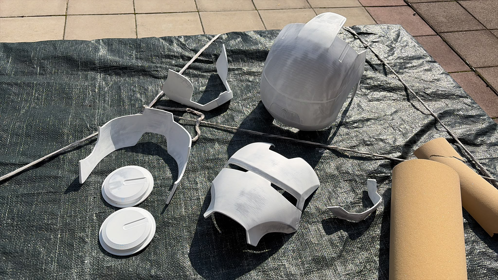
  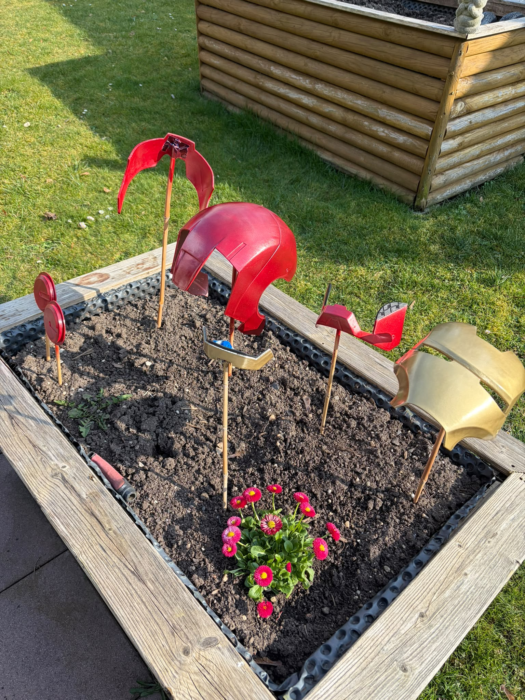
</p>

## Final Result

The completed helmet combines the moving faceplate, integrated electronics and illuminated eyes in a single system.

<p align="center">
  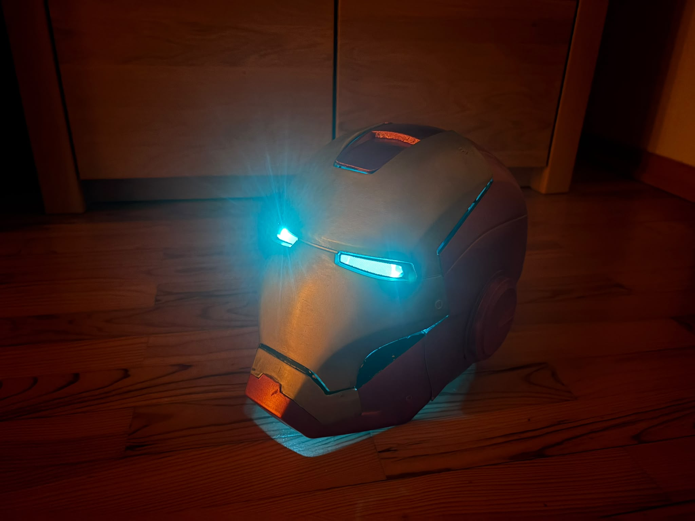
  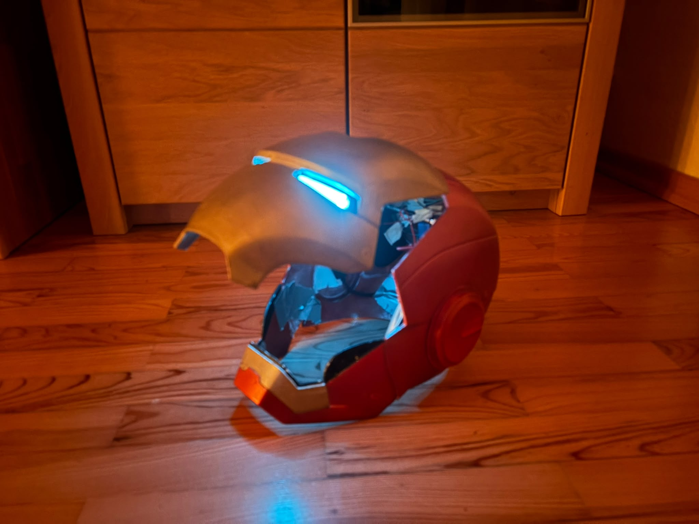
</p>

This project was particularly useful for combining several disciplines in one build: **CAD, 3D printing, mechanical integration, electronics and embedded C++ development**.

## License

This project is licensed under the MIT License. See [LICENSE.md](LICENSE.md) for details.

## Author

**Leon Stein**

Technical projects in software, embedded systems, robotics and automation.
